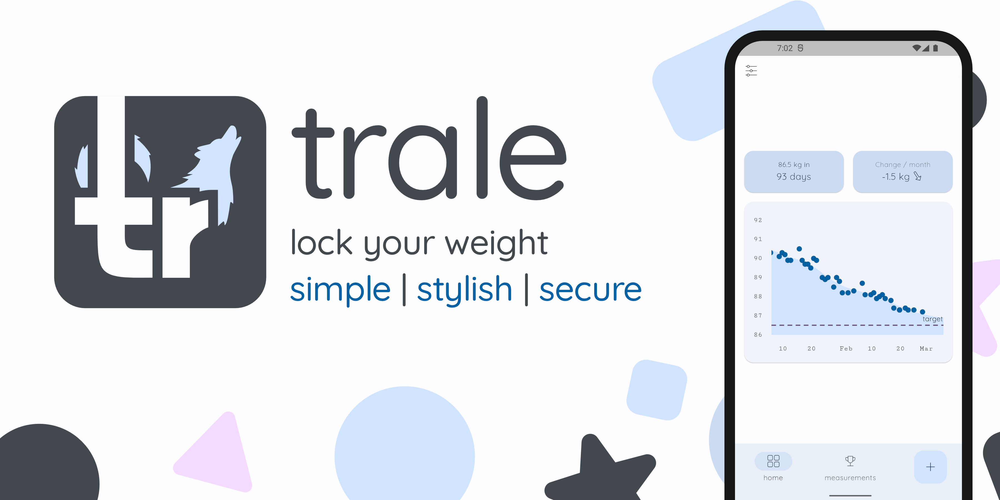
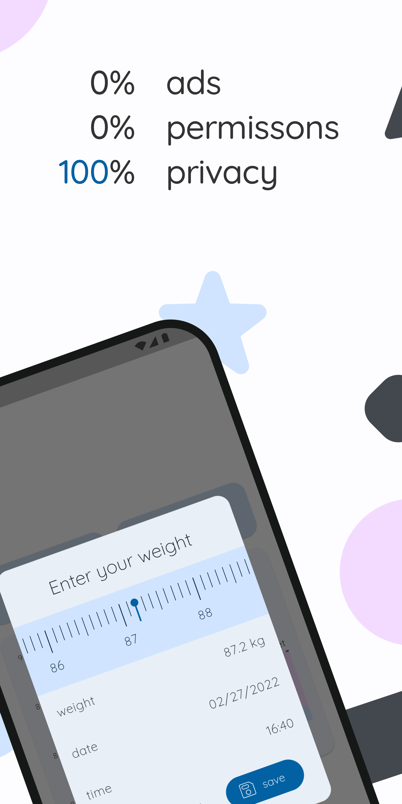
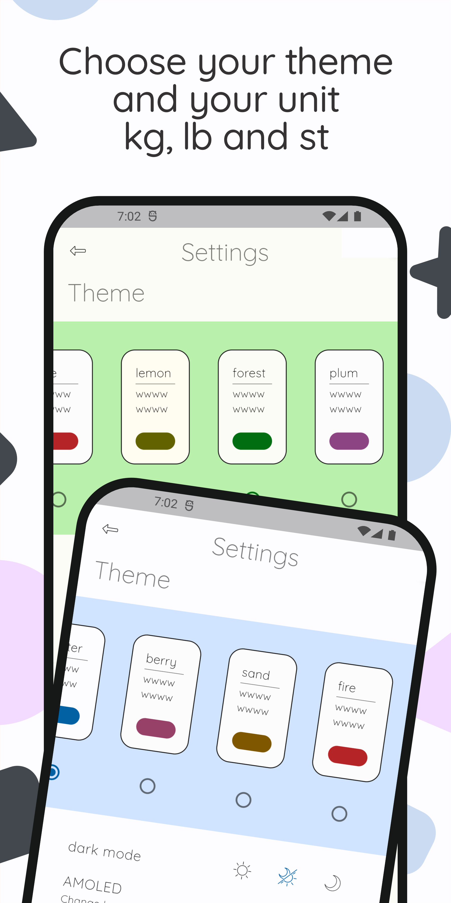
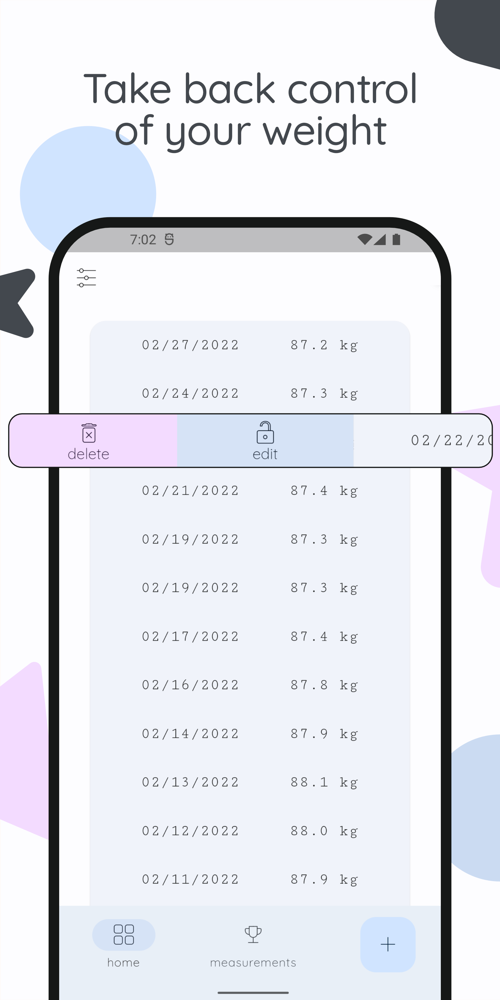

    
    <a href="https://www.gnu.org/licenses/agpl-3.0" alt="License: GPLv3">
    <a href="https://github.com/QuantumPhysique/trale/releases" alt="GitHub releases">
    

# A simple body-weight diary app respecting your privacy.

Lock in your optimal weight by losing or gaining with this simple, material design app.

Join our community today 🐺🤸‍♀️🏋‍♀️🧘‍♂️🏆🥇

## Installation

Preferably use F-Droid. \
The [latest release](https://github.com/QuantumPhysique/trale/releases/latest) can also be downloaded here.

## Why trale 🐺?
- Truly **gratis**: No annoying advertising no permission
- Modern appearance using **Material Design 3**
- **Customizable**: Many custom themes, **dark mode**, and several **units**
- Track your **progress** with state-of-the-art data modeling 🧑‍💻
- Import and export of your measurements
- **Privacy**: Not just empty promises, it is fully <a href="https://github.com/comradekingu/trale/blob/main/LICENSE">copylefted libre software</a>

## Upcoming features 🚀
- [ ] Achievements and motivational messages
- [ ] Add to Google Play store

## Screenshots

    
    
    
    

## FAQ
##### I found a bug
Please open a new <a href="https://github.com/QuantumPhysique/trale/issues">issue</a>.

##### Will this app stay gratis
This app will always be gratis on F-Droid with all features. \
Once leaving beta, a small fee will be added on the Google Play store.

##### Could you please add feature X
At this stage we focus on improving stability before new features. \
Feel free to open a new <a href="https://github.com/QuantumPhysique/trale/issues">issue</a> or a pull request.

##### Can I contribute
- Implementing new functionality. If you are new to Flutter you should first [get started](https://flutter.dev/docs/get-started/install).
- Open issues and help us find bugs, or simply give feedback.
- Share the app with your friends :)

You can help [translate trale on Hosted Weblate](https://hosted.weblate.org/engage/trale/).

## Disclaimer
Anorexia is a serious disease. \
Especially due to the many negative examples in social media, \
anorexia is increasingly a problem for society as a whole. \
In order to make our contribution to prevention, \
no target weight below 50 kg / 110 lb / 7.9 st is possible.

This app is still in <b>beta</b> stage and may contain bugs. \
It should work best with FHD/FHD+ resolution. \
If you encounter a bug or if you are missing a feature, \
please <a href="https://github.com/QuantumPhysique/trale/issues">open a new issue</a>.

## License
The project is licensed [GNU AGPLv3+](https://github.com/comradekingu/trale/blob/main/LICENSE).
