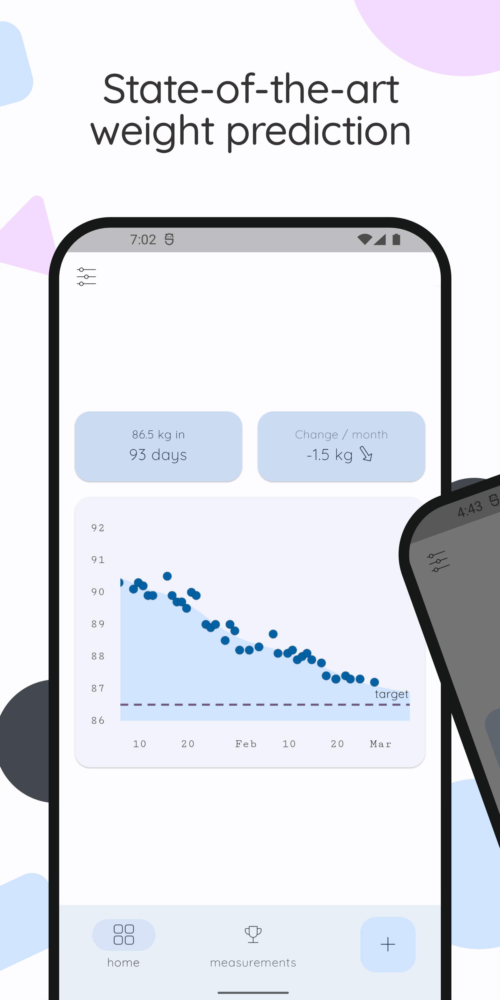

    

# trale – a simple body weight diary app respecting your privacy.

This simplistic, material design app is perfectly suited for locking your
weight. Whether you want to gain or lose weight, this app is the perfect
companion to reach your optimal weight.

Join our community today to trace yourself 🐺🤸‍♀️🏋‍♀️🧘‍♂️🏆🥇

[[_TOC_]]

## Why trale?
	🐺 Truly FREE: No annoying advertising no permission
	🐺 Modern appearance using MATERIAL DESIGN 3
	🐺 CUSTOMIZABLE: Many free custom themes, DARK MODE, and several UNITS. Tracking your PROGRESS
	🐺 Track your PROGRESS with state-of-the-art data modeling 🧑‍💻
	🐺 PRIVACY: Not just empty promises, it is fully <a href="https://gitlab.com/mobilemovement/trale">open-source</a>

## Upcoming features 🚀
	🐺 Import and export of your measurements
	🐺 Achievements and motivational messages

## Screenshots

    
    
    

## FAQ
##### I found a bug
Please open a new <a href="https://gitlab.com/mobilemovement/adonify/-/issues">issue</a>.

##### Will this app stay free
This app will always be free on F-Droid with all features enabled. Once leaving beta, we will charge a small fee on google play store.

##### Could you please add feature X
At the moment the app is in beta stage and there might be many bugs. Therefore, we focus on improving stability before integrating new features. Nevertheless, feel free to open a new <a href="https://gitlab.com/mobilemovement/adonify/-/issues">issue</a> or direclty a merge request so that we know which features are missing most.

##### Will the app be translated to X
At the current stage only a few languages are available. In the near feature we will add this project to weblate to encurage the community to translate the app to new languages.
The database itself (or mainly due to our limited sqllite knowledge) is limited to a single language. But it is possible to create new exercises and workouts with a different language.

##### Can I contribute
For sure, that is the reason why we opened the source code. There are many ways you can help:
- Implementing new functionality. If you are new to flutter you should first [get started](https://flutter.dev/docs/get-started/install)
- Open issues and help us finding bugs or simply give feedback
- or simply share the app with your friends :)

## Disclaimer
Anorexia is a serious disease. Especially due to the many negative examples in
the social media, anorexia is increasingly a problem for society as a whole. In
order to make our contribution to prevention, no target weight below 50 kg /
110 lb / 7.9 st is possible.

This app is still in <b>beta</b> stage and may contain bugs. It should work
best with FHD/FHD+ resolution. If you encounter a bug or if you are missing a
feature, please <a href="https://gitlab.com/mobilemovement/adonify/-/issues">open a new issue</a>.

## License
The source code is licensed under the [Apache License 2.0](http://choosealicense.com/licenses/apache-2.0/).
